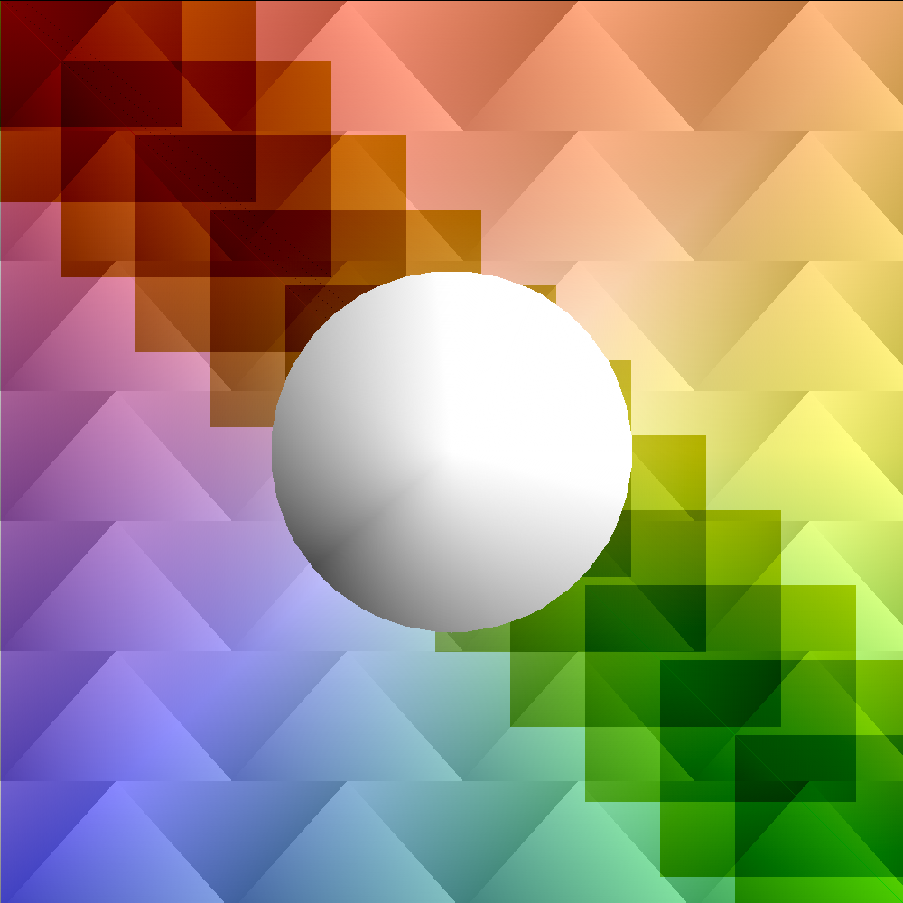

# canvas-drawer

Implements a simple drawing api



## How to build

*Windows*

Open git bash to the directory containing this repository.

```
canvas-drawer $ mkdir build
canvas-drawer $ cd build
canvas-drawer/build $ cmake -G "Visual Studio 16 2019" ..
canvas-drawer/build $ start Draw-2D.sln
```

Your solution file should contain two projects: `pixmap_art` and `pixmap_test`.
To run from the git bash command shell, 

```
canvas-drawer/build $ ../bin/Debug/draw_test
canvas-drawer/build $ ../bin/Debug/draw_art
```

*macOS*

Open terminal to the directory containing this repository.

```
canvas-drawer $ mkdir build
canvas-drawer $ cd build
canvas-drawer/build $ cmake ..
canvas-drawer/build $ make
```

To run each program from build, you would type

```
canvas-drawer/build $ ../bin/draw_test
canvas-drawer/build $ ../bin/draw_art
```

## Supported primitives

- `LINES`
    - Interpolation between two vertices with individual stroke color/alpha/width attributes 
- `TRIANGLES`
    - Joins three vertices into three lines with per-vertex fill color and alpha
- `QUADS`
    - Joins four vertices into two triangles
- `FANS`
    - Joins $n$ vertices into a polygon made of $n-1$ triangles. First vertex specifies the central vertex where all triangles meet.

## Added Functionality
- Quads
- Triangle Fans
- Add and subtract blend modes
- Alpha blending

## Results


Background color gradient uses a triangle fan to specify colors at specific points and is blended over the triangles using alpha blending. Rectangles are implemented with a `QUAD` primitive and use the subtract blend mode. The central sphere is a triangle fan with per-vertex shading.
